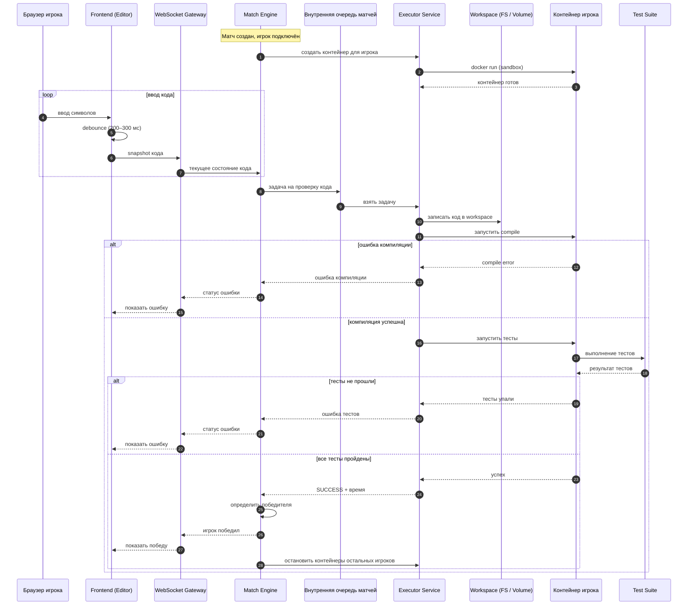

```mermaid
sequenceDiagram
    autonumber

    participant U as Браузер игрока
    participant FE as Frontend (Editor)
    participant WS as WebSocket Gateway
    participant ME as Match Engine
    participant Q as Внутренняя очередь матчей
    participant EX as Executor Service
    participant FS as Workspace (FS / Volume)
    participant C as Контейнер игрока
    participant TS as Test Suite

    Note over ME: Матч создан, игрок подключён
    ME->>EX: создать контейнер для игрока
    EX->>C: docker run (sandbox)
    C-->>EX: контейнер готов

    loop ввод кода
        U->>FE: ввод символов
        FE->>FE: debounce (200–300 мс)
        FE->>WS: snapshot кода
        WS->>ME: текущее состояние кода
    end

    ME->>Q: задача на проверку кода
    Q->>EX: взять задачу

    EX->>FS: записать код в workspace
    EX->>C: запустить compile

    alt ошибка компиляции
        C-->>EX: compile error
        EX-->>ME: ошибка компиляции
        ME-->>WS: статус ошибки
        WS-->>FE: показать ошибку
    else компиляция успешна
        EX->>C: запустить тесты
        C->>TS: выполнение тестов
        TS-->>C: результат тестов

        alt тесты не прошли
            C-->>EX: тесты упали
            EX-->>ME: ошибка тестов
            ME-->>WS: статус ошибки
            WS-->>FE: показать ошибку
        else все тесты пройдены
            C-->>EX: успех
            EX-->>ME: SUCCESS + время
            ME->>ME: определить победителя
            ME-->>WS: игрок победил
            WS-->>FE: показать победу
            ME->>EX: остановить контейнеры остальных игроков
        end
    end
```
